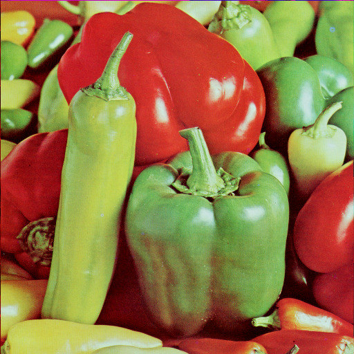

Nama: Iif Alifah

NIM: 2110131220013

---

**1. Bit Plane Slicing**

- Code

- Output

**2. Menggabungkan Foto**
- Gambar 1

- Gambar 2 (teman)

- Setelah digabungkan

- code

- Hasil Bit Plane

**3. Pesan Rahasia**
- Code

- Hasil Foto

