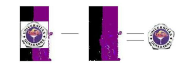

Nama: Iif Alifah

NIM: 2110131220013

---

<b>Spatial dan Frequency Domain</b>

Berdasarkan ranah operasinya, metode untuk perbaikan kualitas citra dapat dikelompokkan menjadi dua kategori:

1. Image enhancement dalam ranah spasial

Metode-metode image enhancement dalam ranah spasial dilakukan
dengan memanipulasi secara langsung pixel-pixel di dalam citra.

Metode pemrosesan citra dalam ranah spasial dinyatakan sebagai:

g(x,y) = T [ f(x,y) ]

T bisa beroperasi pada satu pixel, sekelompok pixel bertetangga, atau keseluruhan pixel di dalam citra.
Jadi, metode dalam ranah spasial dapat dilakukan pada aras titik (pixel), aras lokal, dan aras global. 

2. Image enhancement dalam ranah frekuensi

Metode-metode image enhancement dalam ranah frekuensi
dilakukan dengan mengubah citra terlebih dahulu dari ranah spasial ke ranah frekuensi, baru kemudian memanipulasi nilai-nilai frekuensi tersebut.

---

<b>Metode-Metode Spatial</b>

Peningkatan mutu citra pada domain spatial terbagi menjadi:

1. Point Processing

Cara paling mudah untuk melakukan peningkatan mutu pada domain spatial adalah dengan melakukan pemoresan yang hanya melibatkan satu piksel saja.

- Citra Negatif

Untuk mengubah nilai grey level piksel input dengan:

Gbaru = 255 - Glama

Akan menghasilkan gambar seperti klise foto.

- Contrast Streching

Untuk mengubah kontras dari suatu image dengan cara mengubah grey level piksel-piksel pada citra menurut fungsi s = T(r) tertentu 

- Histogram Equalization

HIstogram processing mengubah bentuk histogram agar pemetaan gray level pada citra juga berubah

- Image Substraction

Dilakukan jika kita ingin mengambil bagian tertentu saja dari citra.

- Image Averaging

Dilakukan jika kita memiliki beberapa citra yang bergambar sama, namun semua citra memiliki noise(gangguan). Noise satu citra berbeda dengan citra lainnya atau tidak berkolerasi. Adapun cara memperbaikinya adalah dengan melakukan operasi rata- rata terhadap semua citra tersebut.

2. Mask Processing

Jika pada point processing kita hanya melakukan operasi terhadap masing-masing piksel, maka pada mask processing kita melakukan operasi terhadap suatu jendela ketetanggan pada citra. Kemudia kita menerapkan suatu mask terhadap jendela tersebut. Mask sering juga disebut filter.

Contoh:

Jendela ketetanggan 3 x 3, nilai piksel pada posisi x dipengaruhi oleh nilai 8 tetangganya.

