Nama: Iif Alifah

NIM: 2110131220013

---

<b>Implementasi Low Pass Filtering dan High Pass Filtering</b>

- **Low Pass Filtering**

Low-pass filtering adalah proses filter yang melewatkan komponen citra dengan nilai intensitas yang rendah dan meredam komponen citra dengan nilai intensitas yang tinggi.
LPF (Low Pass Filter) atau disebut juga smoothing filter merupakan salah satu metode untuk menghilangkan noise acak, noise berkala, dan menampilkan pola latar belakang. Low pass filter diterapkan untuk menghasilkan citra yang lebih halus dan lebih blur. 

Aturan kernel untuk low-pass filter adalah:

- Semua koefisien kernel harus positif
- Jumlah semua koefisien kernel harus sama dengan 1.

1. Menggunakan Fungsi
    - Source Code
    
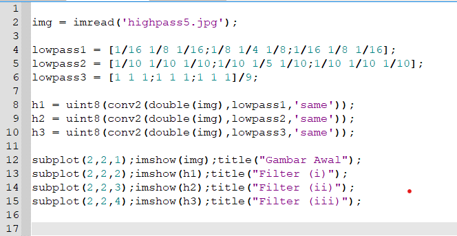

    - Output
    
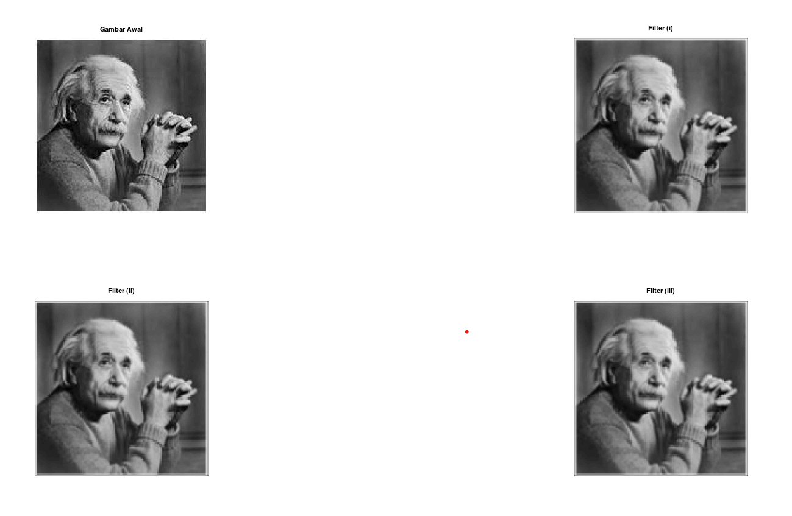

2. Manual

- **High Pass Filtering**

High Pass Filter (HPF) adalah proses filter yang mengambil citra dengan gradiasi intensitas yang tinggi dan perbedaan intensitas yang rendah akan dikurangi atau dibuang. High Pass Filtering adalah salah satu dari metode penajaman (sharpening). 

Tujuan utama dari proses penajaman ini adalah untuk menyoroti detail-detail halus dalam gambar atau untuk meningkatkan detail yang telah dikaburkan baik dalam kesalahan atau efek alami dari proses akuisisi citra tertentu.

Aturan-aturan dalam high-pass filter:
- Koefisien penapis boleh negatif, nol, ataupun bernillai positif.
- Total keseluruhan koefisiennya ialah bernilai 0 ataupun 1.
- Apabila jumlah koefisiennya berjumlah = 0, maka setiap elemen yang rendah frekuensinya nilainya akan menurun. 
- Namun, apabila total dari koefisien adalah = 1, maka elemen yang memiliki frekuensi rendah nilainya tetap sama dengan nilai semula.

1. Menggunakan Fungsi
    - Source Code
    
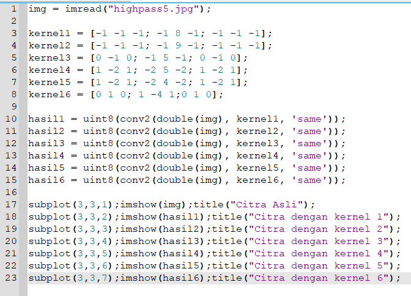

    - Output
    
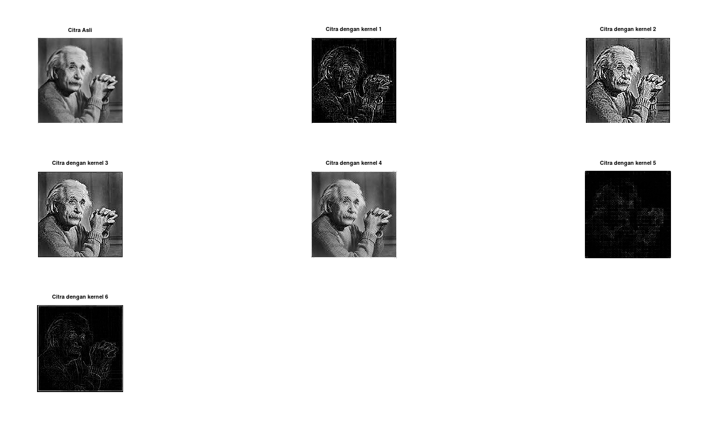

2. Manual

- **High Boost Filtering**

High-Boost Filtering merupakan salah satu bagian dari operasi yang dapat dilakukan untuk melakukan perbaikan citra.
High-Boost Filtering bertujuan untuk menekankan komponen frekuensi tinggi yang mewakili detail gambar tanpa menghilangkan komponen frekuensi rendah (seperti sharpening). Filter high boost dapat digunakan untuk mengubah komponen frekuensi tinggi.

High boost filter di susun oleh semua pass filter dan edge detection filter (Laplacian filter). Dengan demikian,  High boost filtering menekankan  edge dan menghasilkan image sharpener.

1. Menggunakan Fungsi
    - Source Code
    
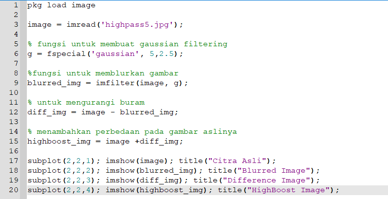

    - Output
    
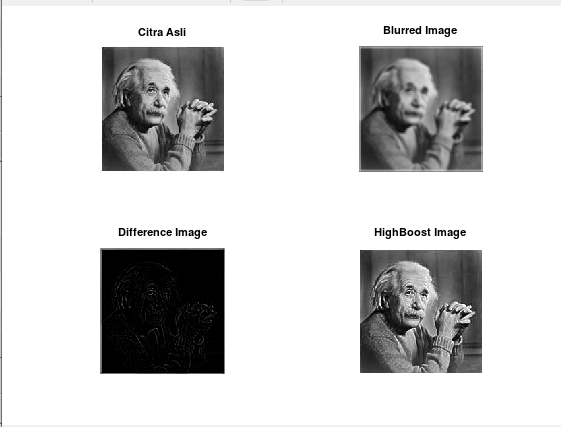

2. Manual

- **Median Filtering**

Median filtering adalah teknik penyaringan digital nonlinear, yang sering digunakan untuk menghilangkan noise. Penyaringan median sangat banyak digunakan dalam pemrosesan gambar digital karena mempertahankan tepi sambil menghilangkan noise.

Median filtering dilakukan pada matriks citra dengan cara mencari median dari piksel tetanggaan dengan menggunakan jendela yang menggeser piksel demi piksel.

Penerapan dari median filtering dapat berupa untuk peningkatan kualitas citra gambar yang mengalami penurunan mutu citra, misalnya karena mengandung cacat atau derau (noise). Contohnya adalah bintik hitam atau putih yang muncul secara acak yang tidak diinginkan di dalam citra. bintik acak ini disebut dengan derau (noise) salt & pepper.

1. Menggunakan Fungsi
- Source Code

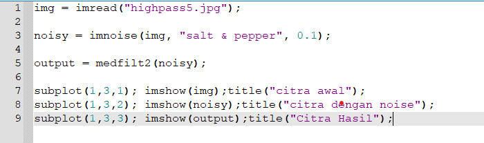

- Output

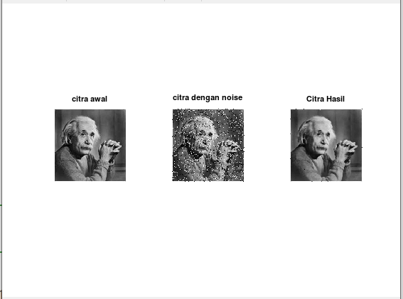

2. Manual
- Source Code

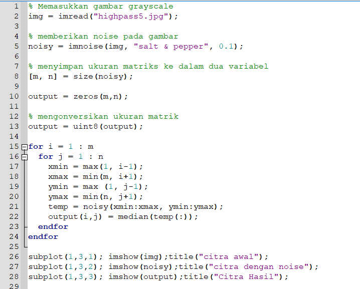

- Output

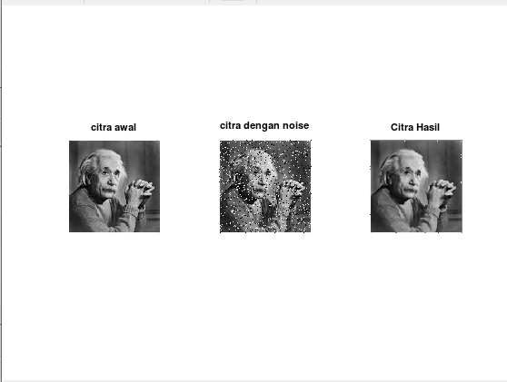

- **Edge Detection**

Deteksi tepi (edge detection) pada suatu citra adalah suatu pendekatan untuk memeroleh tepi-tepi/garis batas dari objek di dalam citra tersebut. Tepi objek bermanfaat untuk segmentasi, registrasi, dan identifikasi antar objek pada citra.

Sutu titik (x, y) dapat dikatakan sebagai tepi jika terjadi perubahan nilai intensitas derajat keabuan (grayscale) yang tinggi dalam jarak yang dekat dengan tetangganya.

1. Menggunakan Fungsi
- Source Code

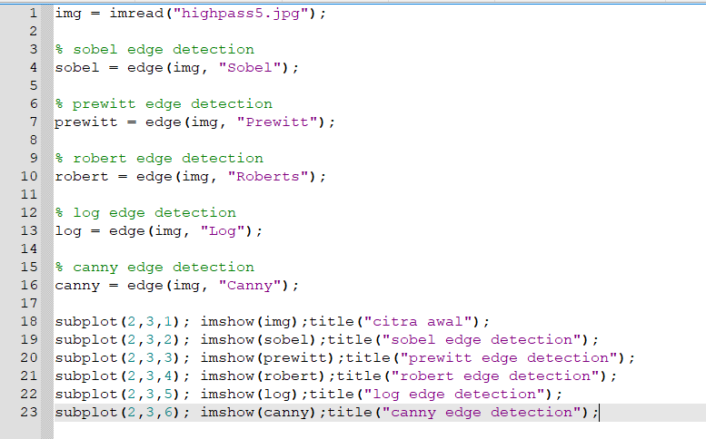

- Output

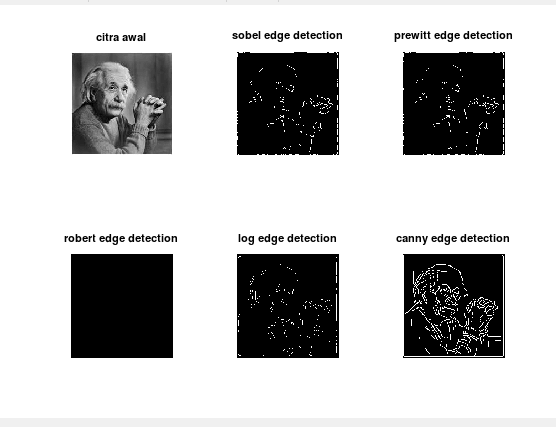

